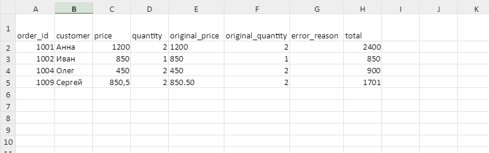
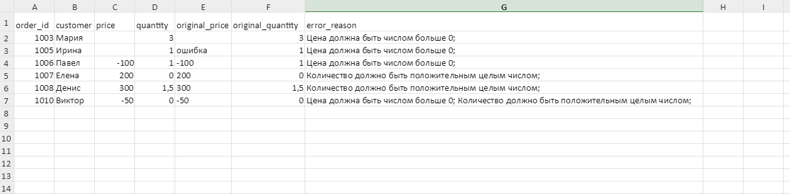

# CSV Orders Cleaner → Excel Report

Python-скрипт для очистки CSV-выгрузки заказов и формирования Excel-отчёта. Удаляет полные дубли, проверяет цену и количество, рассчитывает стоимость и сохраняет проблемные записи с объяснениями на отдельном листе.

**English:** A Python tool that cleans an orders CSV file, validates prices and quantities, calculates order totals, and exports valid and problematic records to separate Excel sheets.

Демонстрационный проект для портфолио. Все имена и заказы в примере вымышленные.

## Какую задачу решает

В выгрузках заказов могут встречаться повторяющиеся строки, лишние пробелы, пропущенные цены и некорректное количество товара. Скрипт выполняет первичную обработку такой таблицы и отделяет записи, требующие исправления, от записей, пригодных для расчёта стоимости.

## Возможности

- Чтение CSV в кодировке UTF-8 с разделителем `;`.
- Проверка наличия обязательных столбцов.
- Удаление пробелов в начале и конце имени покупателя.
- Удаление полностью одинаковых строк после очистки имён.
- Преобразование цены и количества в числа.
- Проверка положительной цены и положительного целого количества.
- Сохранение исходных значений цены и количества до числового преобразования.
- Запись причин ошибок; при нескольких нарушениях сохраняются все соответствующие объяснения.
- Расчёт стоимости каждой корректной записи и общей суммы.
- Экспорт двух листов в одну книгу Excel без служебного индекса pandas.
- Сообщения об отсутствии файла, проблемах доступа и ошибках данных типа `ValueError`.

## Технологии

- Python — язык программирования.
- pandas — обработка таблиц.
- openpyxl — запись Excel через pandas.
- pathlib — работа с путями к файлам.

## Файлы проекта

| Путь | Назначение |
| --- | --- |
| `main.py` | Чтение, обработка и сохранение данных |
| `requirements.txt` | Внешние зависимости |
| `.gitignore` | Исключения для Git |
| `example-input/orders.csv` | Демонстрационная выгрузка |
| `example_output/orders_report.xlsx` | Сформированный Excel-отчёт |
| `README.md` | Описание и инструкция |

## Установка и запуск

Скачайте проект и откройте терминал PowerShell в папке `excel-automation`, где находится `main.py`.

Создайте виртуальное окружение:

```powershell
python -m venv .venv
```

Установите зависимости:

```powershell
.\.venv\Scripts\python.exe -m pip install -r requirements.txt
```

Содержимое `requirements.txt`:

```text
pandas
openpyxl
```

Запустите программу:

```powershell
.\.venv\Scripts\python.exe main.py
```

Активировать окружение отдельно не требуется: команды обращаются прямо к его интерпретатору. Для формирования файла установка Microsoft Excel не нужна; приложение для таблиц понадобится, чтобы открыть результат.

## Формат входных данных

По умолчанию скрипт читает `example-input/orders.csv`.

| Столбец | Содержание | Правило текущей версии |
| --- | --- | --- |
| `order_id` | Номер заказа | Столбец обязателен; значения отдельно не проверяются |
| `customer` | Имя покупателя | Столбец обязателен; пробелы по краям удаляются |
| `price` | Цена единицы товара | Число строго больше нуля |
| `quantity` | Количество в штуках | Положительное целое число |

Названия столбцов должны совпадать с указанными. Дробные цены записываются через точку, например `850.50`. Нулевая цена считается ошибкой: в этом примере учитываются только платные позиции.

Демонстрационный файл:

```csv
order_id;customer;price;quantity
1001; Анна ;1200;2
1002;Иван;850;1
1002;Иван;850;1
1003;Мария;;3
1004; Олег;450;2
1005;Ирина;ошибка;1
1006;Павел;-100;1
1007;Елена;200;0
1008;Денис;300;1.5
1009;Сергей;850.50;2
1010;Виктор;-50;0
```

## Результат

Отчёт сохраняется в `example_output/orders_report.xlsx`. Папка создаётся автоматически. При повторном успешном запуске файл перезаписывается; исходный CSV не изменяется.

### Лист «Корректные заказы»

Содержит записи, прошедшие проверки цены и количества, а также столбец `total`:

```text
total = price × quantity
```

Результат округляется до двух знаков после запятой. Для демонстрационных данных:

| Номер заказа | Покупатель | Стоимость |
| --- | --- | ---: |
| 1001 | Анна | 2400.00 |
| 1002 | Иван | 850.00 |
| 1004 | Олег | 900.00 |
| 1009 | Сергей | 1701.00 |

Общая сумма **5851.00** выводится в терминале; отдельная строка итога в Excel пока не добавляется.

### Лист «Проблемные заказы»

Содержит записи с ошибками, столбцы `original_price`, `original_quantity` и `error_reason`. Например, у Виктора будут указаны нарушения и цены, и количества. Эти заказы не включаются в общую сумму.

Пропущенные значения, отображаемые в pandas как `NaN`, записываются в Excel пустыми ячейками.

### Вывод в терминале

```text
Исходных строк: 11
Удалено дублей: 1
Корректных заказов: 4
Проблемных заказов: 6
Общая стоимость: 5851.00
Отчёт сохранён: <путь к проекту>/example_output/orders_report.xlsx
```

## Устройство программы

| Функция | Ответственность |
| --- | --- |
| `load_orders(input_path)` | Читает CSV и проверяет наличие столбцов |
| `process_orders(df)` | Обрабатывает копию таблицы; возвращает корректные записи, проблемные записи и число удалённых дублей |
| `save_report(valid_orders, problem_orders, output_path)` | Создаёт папку и записывает оба листа Excel |
| `main()` | Запускает этапы, обрабатывает предусмотренные ошибки и выводит итог |

Пути задаются константами `INPUT_PATH`, `OUTPUT_DIR` и `OUTPUT_PATH` в `main.py`. Они строятся относительно расположения скрипта.

## Проверенные вручную сценарии

- Удаление повторяющейся записи заказа `1002`.
- Выделение пропущенной, текстовой и отрицательной цены.
- Отклонение нулевого и дробного количества.
- Приём дробной цены `850.50`.
- Сохранение двух причин ошибки для одной записи.
- Сообщение об отсутствии столбца `quantity`.
- Открытие сформированного отчёта и проверка обоих листов.

## Ограничения текущей версии

- Обрабатывается один CSV заданной структуры. Чтение XLSX и объединение нескольких файлов не реализованы.
- Дубли определяются по всем столбцам после очистки имён. Конфликтующие строки с одинаковым `order_id` отдельно не проверяются.
- Полноценная проверка значений номера заказа и имени покупателя не реализована. Лист «Корректные заказы» означает прохождение имеющихся проверок цены и количества.
- Числовое преобразование не заменяет полную проверку всех возможных значений и форматов; специальные значения вроде бесконечности отдельно не обрабатываются.
- Исходные значения сохраняются после чтения CSV библиотекой pandas, а не как точная текстовая копия ячеек файла.
- Для расчётов используются числа с плавающей точкой и округление; точная денежная арифметика через `Decimal` или целые копейки не реализована.
- Версии зависимостей пока не закреплены, автоматических тестов нет.

## Если возникла ошибка

- **Файл не найден:** проверьте расположение `example-input/orders.csv`.
- **Отсутствуют столбцы:** проверьте первую строку CSV и разделитель `;`.
- **Нет доступа к файлу:** закройте открытый отчёт в Excel и проверьте права на папку.
- **После ошибки виден старый отчёт:** ранее созданный файл не удаляется. Ориентируйтесь на сообщение об успешном сохранении в текущем запуске.
- **Заголовки в Excel не помещаются:** увеличьте ширину столбцов; автоматическое оформление пока не добавлено.

## Скриншоты отчёта

### Корректные заказы


### Проблемные заказы
